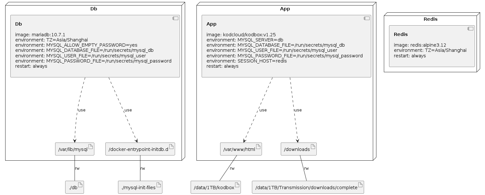

# docker-compose-files

此项目将 traefik 与后台服务进行了分离，在启动 traefik 之后、对后端服务的操作（启动、停止）不影响 Web 服务器的运行，不需要重启 traefik，保证了其他服务的运行稳定性。
 
## 使用方法：

1. 首先使用 `docker-compose` 启动 `traefik`

```shell
cd traefik
sudo docker-compose up -d
```

2. 选择需要的应用、修改必要的配置文件、然后使用 `docker-compose` 启动相应的服务。

## 例如 Cloudreve
### 1.修改 docker-compose.yaml
```shell
nano docker-compose.yaml
###
  aria2: 
    image: p3terx/aria2-pro
    ...
    environment: 
      - PUID=1000
      - PGID=1000
      - RPC_SECRET=
      - UPDATE_TRACKERS=true
      - DISK_CACHE=64M
      - IPV6_MODE=true
    volumes: 
      - /data/Cloudreve/aria2/config:/config
      - /data/Cloudreve/aria2/downloads:/downloads
    network_mode: host

  cloudreve: 
  ...
    labels:
      - "traefik.enable=true"
      - "traefik.port=5212"
      - "traefik.http.routers.cloudreve.rule=Host(`cloudreve.exampl.org`)" # 修改为自己的域名
      - "traefik.http.routers.cloudreve.entrypoints=websecure"
      - "traefik.http.routers.cloudreve.tls.certresolver=myresolver"
    volumes: 
      - /data/Cloudreve/uploads:/cloudreve/uploads
      - /data/Cloudreve/aria2/downloads:/downloads
      - /data/Cloudreve/conf.ini:/cloudreve/conf.ini
        #- /data/Cloudreve/cloudreve.db:/cloudreve/cloudreve.db
      - /data/Cloudreve/avatar/:/cloudreve/avatar/
      # - /data/Transmission/downloads/complete/:/Transmission # 其他的宿主机目录
      
  db:
    image: mariadb
    command: --max_allowed_packet=32505856 --character-set-server=utf8mb4 --collation-server=utf8mb4_general_ci --transaction-isolation=READ-COMMITTED --binlog-format=ROW
    container_name: cloudreve_db
    restart: always
    volumes:
      - /data/Cloudreve/mysql:/var/lib/mysql
    environment:
      - MYSQL_ROOT_PASSWORD=
      - MYSQL_PASSWORD=
      - MYSQL_DATABASE=cloudreve
      - MYSQL_USER=cloudreve

```
### 2. 修改 conf.ini
```ini
[System]
Mode = master
Listen = :5212
Debug = false
; Session 密钥, 一般在首次启动时自动生成
SessionSecret = 23333
; Hash 加盐, 一般在首次启动时自动生成
HashIDSalt = something really hard to guss

; 数据库相关，如果你只想使用内置的 SQLite数据库，这一部分直接删去即可
[Database]
; 数据库类型，目前支持 sqlite | mysql
Type = mysql
; MySQL 端口
Port = 3306
; 用户名
User = cloudreve
; 密码
Password = 
; 数据库地址
Host = cloudreve_db
; 数据库名称
Name = cloudreve
; 数据表前缀
TablePrefix = cd_
; SQLite 数据库文件路径
; DBFile = cloudreve.db

; Redis 相关
[Redis]
Server = redis:6379
Password =
DB = 0
```


### Infrastructure model

