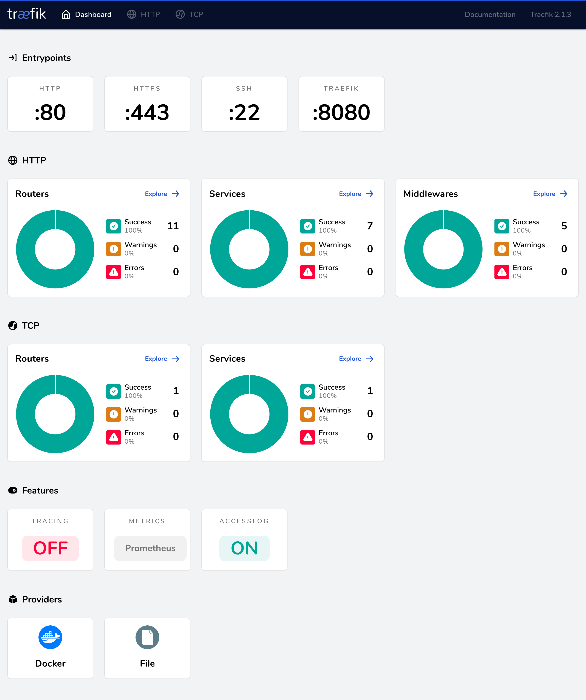

# traefik

**本项目的核心组件**、服务自动发现的承担者

项目地址：https://github.com/traefik/traefik

文档地址：https://doc.traefik.io/traefik/


## 本项目特点

1. docker 服务发现
2. HTTPS 自动配置
3. prometheus 数据接口
4. web-ui
5. 80-443 强制跳转

## 注意

1. 该容器应在第一时间启动
2. `/letsencrypt/acme.json` 证书文件权限需要为 `600` 否则会报错，挂载时如果报错请注意检查权限

## 启动参数解读

```yaml
    command:
    # 调试模式
    #   - "--log.level=DEBUG"
    # 取消下行注释即可使用 traefik 面板
    #   - "--api.insecure=true"
      - "--providers.docker=true"
      - "--providers.docker.exposedbydefault=false"
      # http 入口点 别名 web
      - "--entrypoints.web.address=:80"
      # https 入口点 别名 websecure
      - "--entrypoints.websecure.address=:443"
      # 启动 https 自动配置
      - "--certificatesresolvers.myresolver.acme.httpchallenge=true"
      # https 认证接口为 web
      - "--certificatesresolvers.myresolver.acme.httpchallenge.entrypoint=web"
      # - "--certificatesresolvers.myresolver.acme.caserver=https://acme-staging-v02.api.letsencrypt.org/directory"
      # 自动配置证书时使用指定DNS
      - "--certificatesResolvers.myresolver.acme.dnsChallenge.resolvers=1.1.1.1:53,8.8.8.8:53"
      # 联系邮箱 如果证书过期发送邮件的地址
      - "--certificatesresolvers.myresolver.acme.email=me@example.org"
      # 证书信息储存路径、已经持久化存储
      - "--certificatesresolvers.myresolver.acme.storage=/letsencrypt/acme.json"
      # 强制 HTTPS 跳转
      - "--entrypoints.web.http.redirections.entryPoint.to=websecure"
      - "--entrypoints.web.http.redirections.entryPoint.scheme=https
      # 取消注释即可使用 prometheus 搜集性能数据
#       - "--metrics.prometheus=true"
```
- traefik 面板

